# 实验机器

125G 内存

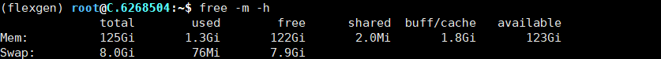

2个CPU    12核     支持超线程    所以一共有48个逻辑CPU

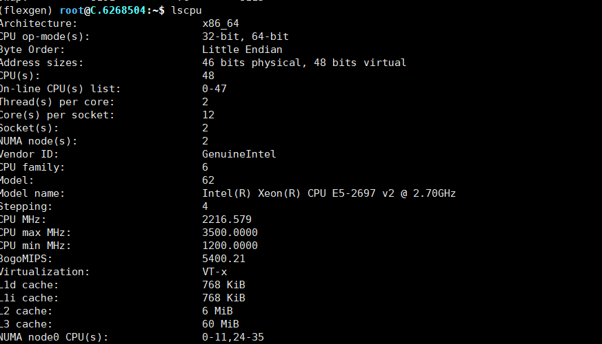

相比之下，原论文的硬件配置如下：

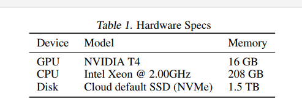

# flexgen

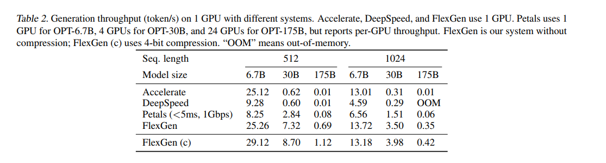

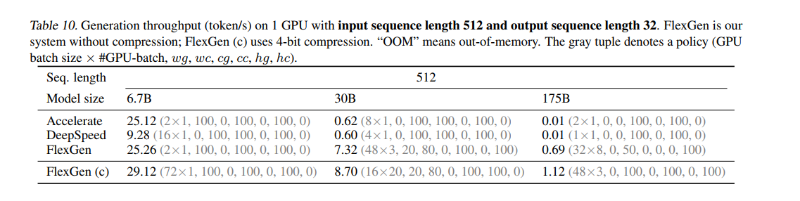

## 控制变量 percent 20 80 0 100 0 100  gpu-batch-size 48

### opt-30b  --num-gpu-batches 4 

python3 -m prefill.flex_opt_prefill --model facebook/opt-30b --percent 20 80 0 100 0 100 --num-gpu-batches 4 --gpu-batch-size 48

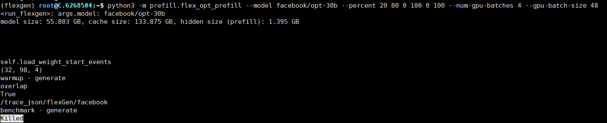

本机器128GM 内存，而在benchmark generate阶段需要存储 0.8*55+133.875+1.395=179.27GB数据，超过存储空间限制，因为 内存溢出，导致被kill掉

### opt-30b --num-gpu-batches 3

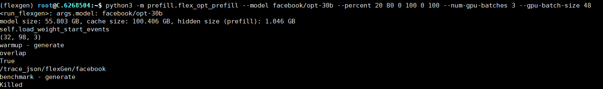

本机器128GM 内存，而在benchmark generate阶段超过存储空间限制，因为 内存溢出，导致被kill掉

### opt-30b --num-gpu-batches 2

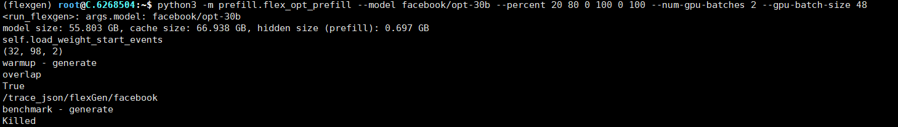

本机器128GM 内存，而在benchmark generate阶段未超过存储空间限制，按理说不应该被kill

### opt-30b  --num-gpu-batches 4 --compress-cache --compress-weight

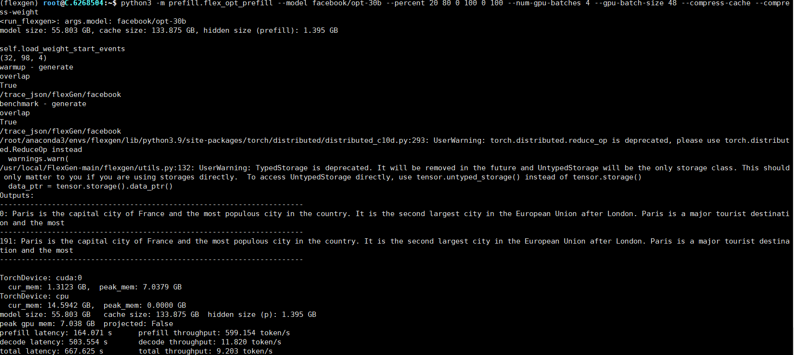

和原文结果接近，牛！

#### profile文件分析

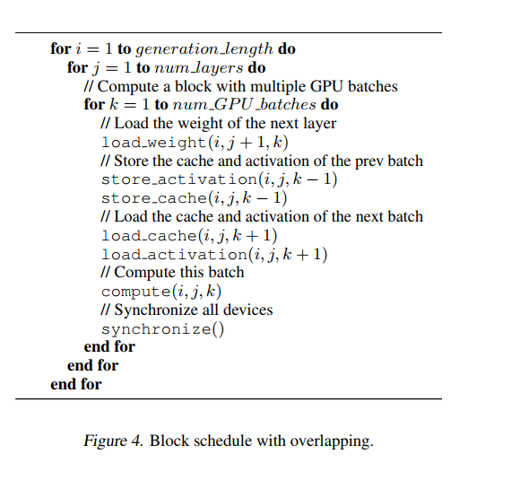

- 各个步骤的顺序满足上述伪代码表述的顺序
- **问题：各个步骤并没有时间上的重叠？**
- prefill阶段后，各个步骤的前后间隔呈现很强的规律性

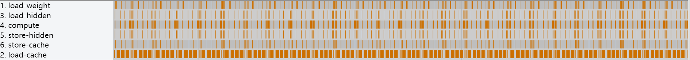

- 在prefill阶段过后，即gen_len_id大于0时，有了load_cache和store_cache操作，compute的时间显著降低，证明overlap是有用滴。此时性能瓶颈从compute变成了load_cache。之后基本都是这样的pattern


### opt-30b num-gpu-batches 1 --compress-cache --compress-weight

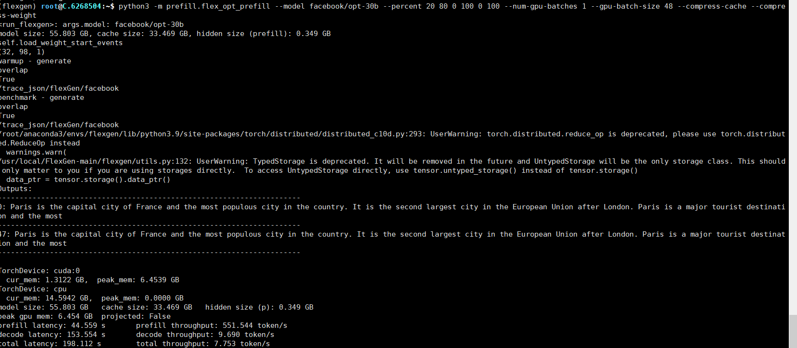

和原文结果接近，it makes sense


## facebook/opt-175b --percent 0 0 100 0 100 0

### opt-175b 需要申请获得权重参数


```
python3 -m flexgen.flex_opt_prefill --model facebook/opt-175b --percent 0 0 100 0 100 0 --num-gpu-batches 4 --offload-dir /user/local/flexgen/offload
```


# dist-flexgen

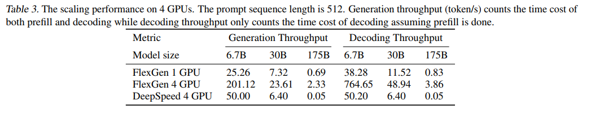

need to be compressed

## 控制变量 percent 20 80 0 100 0 100 gpu-batch-size 12

### opt-30b num-gpu-batches 3  --compress-weight --compress-cache

mpirun --allow-run-as-root --mca btl_tcp_if_exclude lo,docker0 --mca oob_tcp_if_exclude lo,docker0 --map-by ppr:4:node:pe=12 --oversubscribe -H 172.17.0.3 --bind-to core:overload-allowed -x OMP_NUM_THREADS=12 --mca orte_base_help_aggregate 0 --verbose /root/anaconda3/envs/flexgen/bin/python -m prefill.dist_flex_opt_prefill --head-ip 172.17.0.3 --port 7777 --use-mpi --model facebook/opt-30b --gpu-batch-size 12 --num-gpu-batches 3 --percent 20 80 0 100 0 100 --comm-device cpu --compress-weight --compress-cache --path _DUMMY_ --cut-gen-len 2 --cpu


WARNING: Open MPI tried to bind a process but failed.  This is a
warning only; your job will continue, though performance may
be degraded.

  Local host:        6a251bf104a5
  Application name:  /root/anaconda3/envs/flexgen/bin/python
  Error message:     failed to bind memory
  Location:          rtc_hwloc.c:447

--------------------------------------------------------------------------
--------------------------------------------------------------------------
WARNING: Open MPI tried to bind a process but failed.  This is a
warning only; your job will continue, though performance may
be degraded.

  Local host:        6a251bf104a5
  Application name:  /root/anaconda3/envs/flexgen/bin/python
  Error message:     failed to bind memory
  Location:          rtc_hwloc.c:447

--------------------------------------------------------------------------
--------------------------------------------------------------------------
WARNING: Open MPI tried to bind a process but failed.  This is a
warning only; your job will continue, though performance may
be degraded.

  Local host:        6a251bf104a5
  Application name:  /root/anaconda3/envs/flexgen/bin/python
  Error message:     failed to bind memory
  Location:          rtc_hwloc.c:447

--------------------------------------------------------------------------
--------------------------------------------------------------------------
WARNING: Open MPI tried to bind a process but failed.  This is a
warning only; your job will continue, though performance may
be degraded.

  Local host:        6a251bf104a5
  Application name:  /root/anaconda3/envs/flexgen/bin/python
  Error message:     failed to bind memory
  Location:          rtc_hwloc.c:447

--------------------------------------------------------------------------
test
Initializing distributed environment at 172.17.0.3:7777, world_size=4, rank=0, local_rank=0.
test
Initializing distributed environment at 172.17.0.3:7777, world_size=4, rank=1, local_rank=1.
test
Initializing distributed environment at 172.17.0.3:7777, world_size=4, rank=2, local_rank=2.
test
Initializing distributed environment at 172.17.0.3:7777, world_size=4, rank=3, local_rank=3.
rank #3: Finished initializing distributed environment
rank #1: Finished initializing distributed environment
rank #0: Finished initializing distributed environment
rank #2: Finished initializing distributed environment
rank #0: global_rank0
rank #3: global_rank3
rank #2: global_rank2
rank #1: global_rank1
rank #2: =======Current micro-batch send/recv size: 1344 MB (fp16)
rank #2: =======Number of micro-batches: 4.
rank #2: model size: 55.803 GB, cache size: 100.406 GB, hidden size (prefill): 1.046 GB
rank #2: warmup - generate
rank #1: =======Current micro-batch send/recv size: 1344 MB (fp16)
rank #1: =======Number of micro-batches: 4.
rank #1: model size: 55.803 GB, cache size: 100.406 GB, hidden size (prefill): 1.046 GB
rank #1: warmup - generate
rank #0: =======Current micro-batch send/recv size: 1344 MB (fp16)
rank #0: =======Number of micro-batches: 4.
rank #0: model size: 55.803 GB, cache size: 100.406 GB, hidden size (prefill): 1.046 GB
rank #0: warmup - generate
rank #3: =======Current micro-batch send/recv size: 1344 MB (fp16)
rank #3: =======Number of micro-batches: 4.
rank #3: model size: 55.803 GB, cache size: 100.406 GB, hidden size (prefill): 1.046 GB
rank #3: warmup - generate
rank #3: output:prefilling/generate_overlap_Truenum_gpu_batches_3_percent_[20, 80, 0, 100, 0, 100]pp_rank:3.json
rank #1: output:prefilling/generate_overlap_Truenum_gpu_batches_3_percent_[20, 80, 0, 100, 0, 100]pp_rank:1.json
rank #2: output:prefilling/generate_overlap_Truenum_gpu_batches_3_percent_[20, 80, 0, 100, 0, 100]pp_rank:2.json
rank #0: output:prefilling/generate_overlap_Truenum_gpu_batches_3_percent_[20, 80, 0, 100, 0, 100]pp_rank:0.json
rank #1: benchmark - generate
rank #3: benchmark - generate
rank #2: benchmark - generate
rank #0: benchmark - generate
rank #3: output:prefilling/generate_overlap_Truenum_gpu_batches_3_percent_[20, 80, 0, 100, 0, 100]pp_rank:3.json
rank #1: output:prefilling/generate_overlap_Truenum_gpu_batches_3_percent_[20, 80, 0, 100, 0, 100]pp_rank:1.json
rank #2: output:prefilling/generate_overlap_Truenum_gpu_batches_3_percent_[20, 80, 0, 100, 0, 100]pp_rank:2.json
rank #0: output:prefilling/generate_overlap_Truenum_gpu_batches_3_percent_[20, 80, 0, 100, 0, 100]pp_rank:0.json
/root/anaconda3/envs/flexgen/lib/python3.9/site-packages/numpy/core/fromnumeric.py:3464: RuntimeWarning: Mean of empty slice.
  return _methods._mean(a, axis=axis, dtype=dtype,
/root/anaconda3/envs/flexgen/lib/python3.9/site-packages/numpy/core/_methods.py:192: RuntimeWarning: invalid value encountered in scalar divide
  ret = ret.dtype.type(ret / rcount)
/root/anaconda3/envs/flexgen/lib/python3.9/site-packages/torch/distributed/distributed_c10d.py:293: UserWarning: torch.distributed.reduce_op is deprecated, please use torch.distributed.ReduceOp instead
  warnings.warn(
/usr/local/FlexGen-main/flexgen/utils.py:132: UserWarning: TypedStorage is deprecated. It will be removed in the future and UntypedStorage will be the only storage class. This should only matter to you if you are using storages directly.  To access UntypedStorage directly, use tensor.untyped_storage() instead of tensor.storage()
  data_ptr = tensor.storage().data_ptr()
rank #3: TorchDevice: cuda:3
rank #3:   cur_mem: 0.3319 GB,  peak_mem: 2.1732 GB
rank #3: TorchDevice: cpu
rank #3:   cur_mem: 4.0911 GB,  peak_mem: 0.0000 GB
rank #3: model size: 55.803 GB	cache size: 100.406 GB	hidden size (prefill): 1.046 GB
peak gpu mem: 2.173 GB
prefill latency: 68.99 s	prefill throughput: 1068.64 token/s
decode latency: nan s	decode throughput: nan token/s
total latency: nan s	total throughput: nan token/s

### 源代码似乎吧decode lantency给隐藏起来了

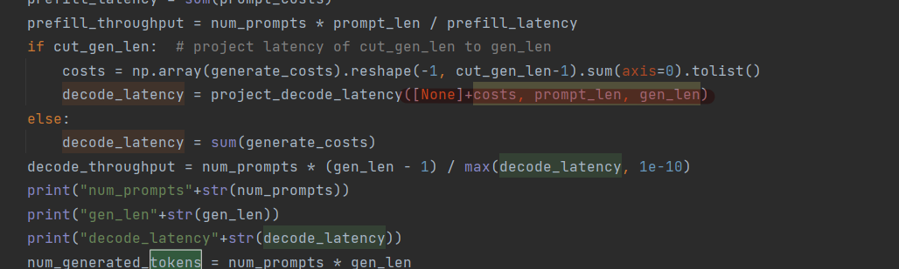

costs不为nan 但是decode_latency为nan