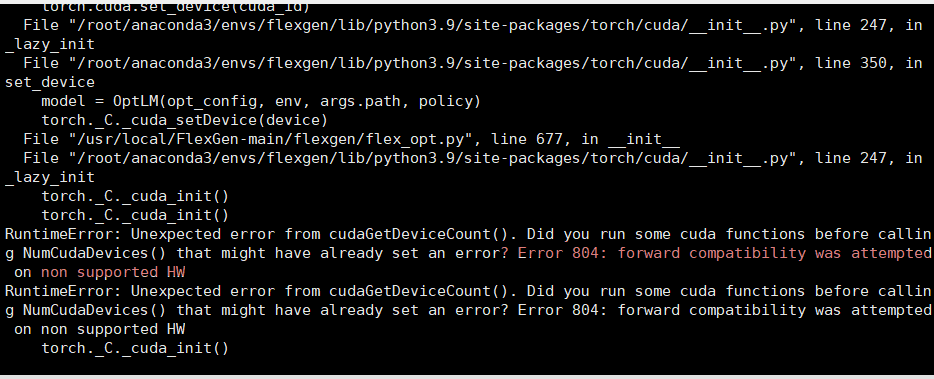
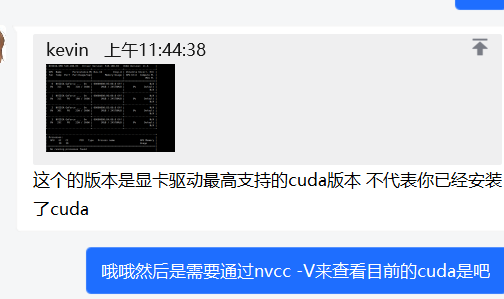
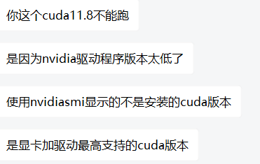
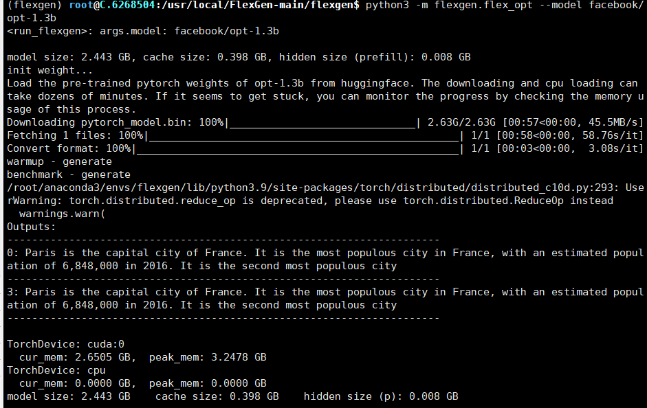
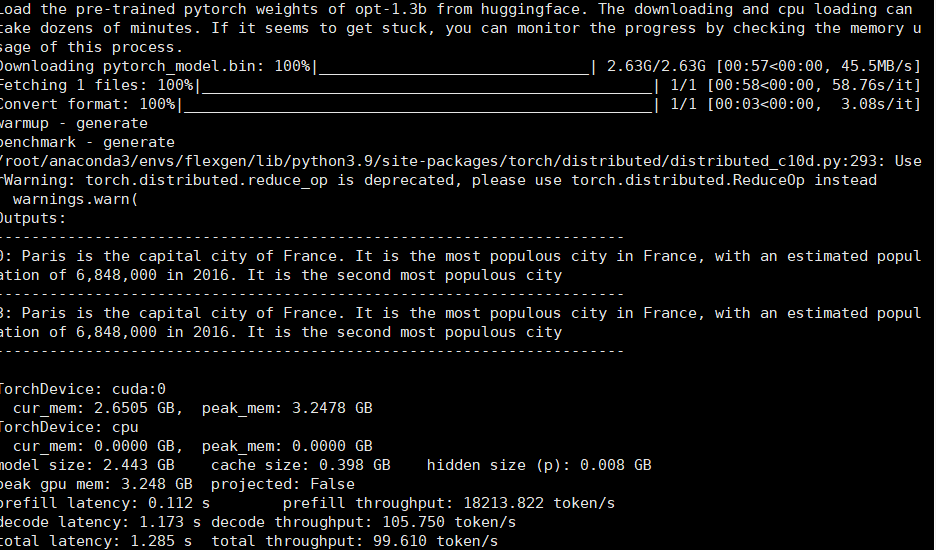
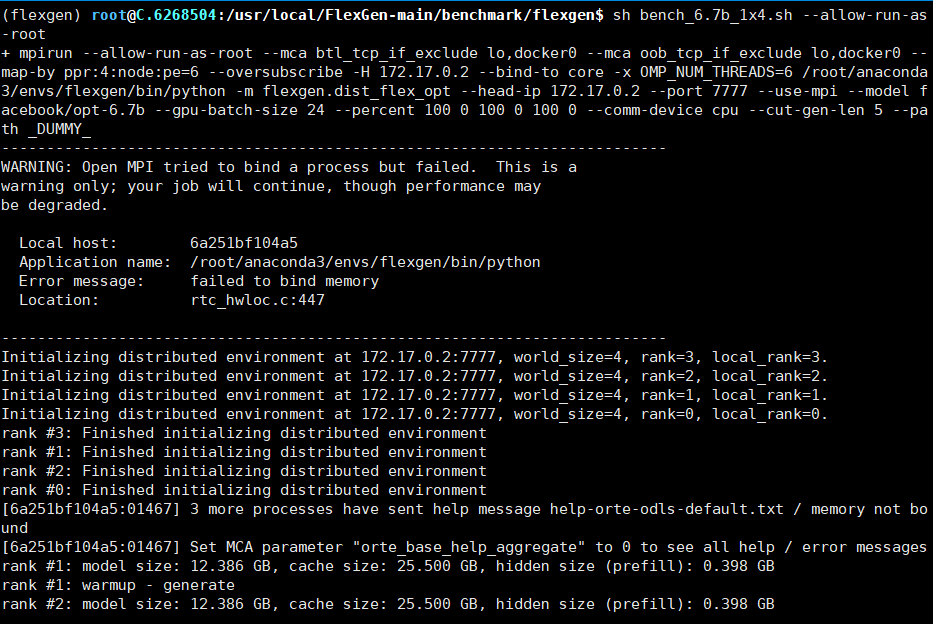
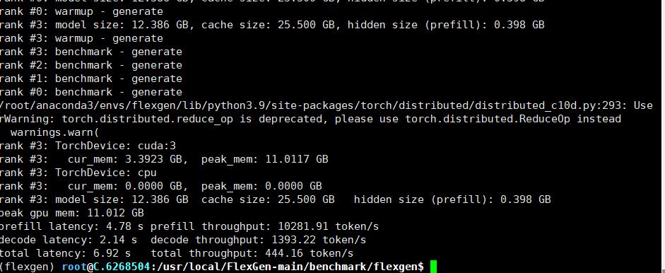

# 遇到的问题：

原因，驱动版本太低：

nvida-smi表示目前显卡驱动最高支持的cuda版本 不代表你已经安装了cuda

解决方式，安装cuda 11.6

python3 -m prefill.dist_flex_opt_prefill --model facebook/opt-1.3b --gpu-batch-size 16  --percent 100 0 100 0 100 0  --comm-device gpu

